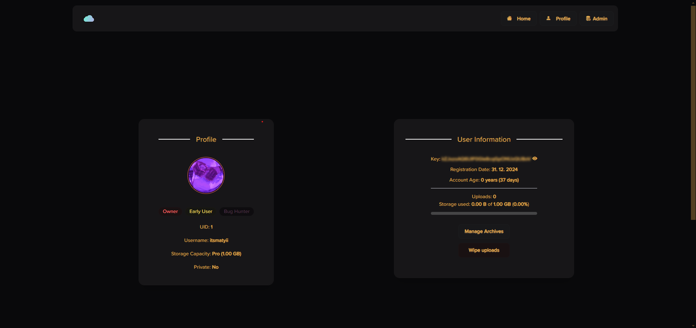
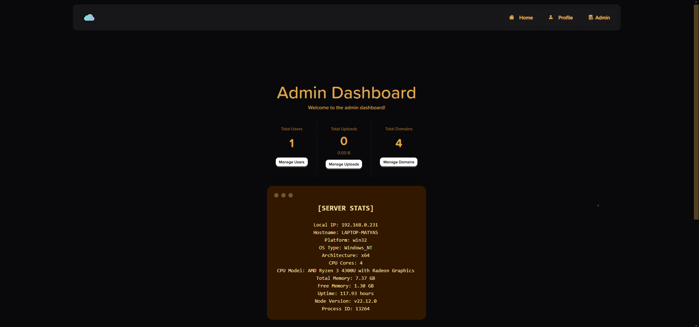
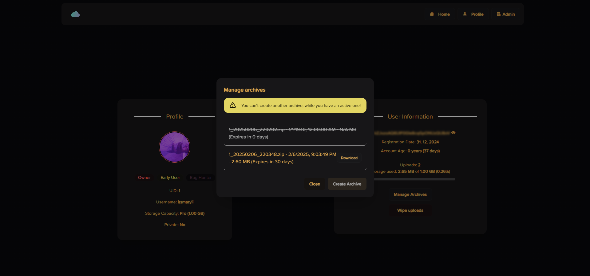
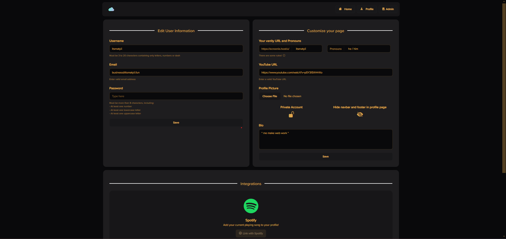
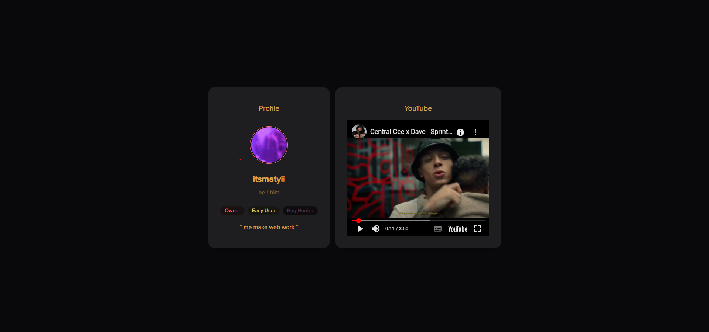
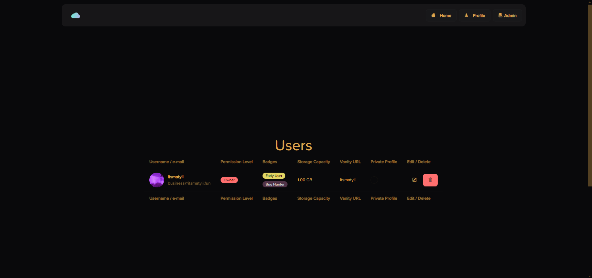

<div align="center">
    
    <div>
        <h1>screenie</h1>
        <h5>ShareX screenshot uploader built with NodeJS and <a href="https://v5.daisyui.com/" target="_blank">DaisyUI</a></h5>
    </div>
</div>

## Features
- Easy configuration
- Automatic config generation for each user
- A user-friendly dashboard
- Archive management to zip the users uploaded files and let them download for 30 days
- User profile management with custom vanity URL and much more
- Badge system for users
- Storage capacity management
- Detailed user and admin dashboard
- Theme customization with [multiple themes available](https://v5.daisyui.com/docs/themes/)


## Screenshots
<details>
    <summary>User Dashboard</summary>
    

</details>
<details>
    <summary>Admin Dashboard</summary>
    

</details>
<details>
    <summary>Archive Management</summary>
    

</details>
<details>
    <summary>Profile Customization</summary>
    

</details>
<details>
    <summary>Example Public Profile</summary>
    

</details>
<details>
    <summary>User Management Dashboard</summary>
    

</details>

<details>
    <summary><h2>Plans in the future</h2></summary>

| Completed? | Description |
| :---: | --- |
| ❌ | Trying to move the project to a framework |
| ❌ | Spotify API for the profiles |
| ❌ | Expanding the dashboard |
| ❌ | Adding GitHub packages |

</details>


<details>
    <summary><h2>Known issues</h2></summary>


| Fixed? | Description |
| :---: | --- |
| ❌ | When uploading a profile picture, the temporary file is "busy" and can't delete |
| ❌ | Admins can demote themselves |
| ❌ | email/username/password validation needs to be fixed |

</details>

<details>
    <summary><h2>One-line easy install</h2></summary>

```Soon!```

</details>


<details>
    <summary><h2>Buildind the docker image</h2></summary>

- Build the image with command: ```docker build --no-cache . -t screenie``` For building the development source, add ```--build-arg BRANCH=development``` to the command line.
- Run container with command: ```docker run --name screenie -d --rm -p 80:80 screenie:latest```

- If you want pesistent storage for database, uploads and archives, create volumes with command: ```docker volume create screenie-database-volume; docker volume create screenie-uploads-volume; docker volume create screenie-archives-volume```
- Then run the container with command ```docker run --name screenie -d --rm -p 80:80 -v screenie-database-volume:/var/lib/mysql -v screenie-uploads-volume:/screenie/src/uploads -v screenie-archives-volume:/screenie/src/archives localhost/screenie:latest```

- You can now open screenie on the domain and port, you've set it up in ```data/config.json```.
</details>

<details>
    <summary><h2>Advanced install</h2></summary>


- Download / Clone the source code.
- Run `chmod +x install.sh && ./install.sh`(Linux) and `node init/init.js`(Windows) for installing the dependencies
- Fill in the `config.json` config file.
- If you have made any changes to the design, run `npm run build:css` to rebuild the CSS file.
- To run the server, use the command `node .` or `npm start` to run the server.
</details>

<details>
    <summary><h2>Configuration</h2></summary>

Here is a list of all the keys in the config with their meaning:

| Entry name | Description |
| --- | --- |
| `maindomain` | This is the main domain, if a domain is not set in the config it falls back to this. |
| `uploadkeylength` | The length of characters that are in the upload key. |
| `nodeserverport` | The port for the server. |
| `maxSizePerFileMB` | The maximum size per file in megabytes. |
| `discordInviteURL` | The URL for the Discord invite endpoint. (`maindomain.example/discord` is going to redirect the user to the URL given here) |

### .env File
Here is a list of all the keys in the `.env` file with their meaning:

| Entry name | Description |
| --- | --- |
| `DB_HOST` | The database host IP. |
| `DB_USER` | The database user. |
| `DB_PASSWORD` | The database password. |
| `DB_NAME` | The database name. (default: `screenie`) |
</details>

<details>
    <summary><h2>How to add new endpoints</h2></summary>
    
To make a new endpoint you need to make a file in the `routes` folder with your name of choice. Example: `example.js`
The empty version should look like this:
    
```js
const express = require('express')
const router = express.Router()
router.get("/", (req, res) => {
    res.send('Hello!')
})
module.exports = router;
```

Then you just need to add a new value to the `"routes.json"` array:
```json
{
        "endpoint": "/yourendpoint",
        "location": "./routes/yourfile"
}
```

> DISCLAIMER
> In your endpoint JS file, leave the router endpoint on `"/"`, since you will be giving the name of the route in the main `routes.json` file.
</details>

<details>
<summary><h2>How to add new folder endpoints to the folder checker</h2></summary>
    
To add new folders to the checker, you simply add a new list element containing the path of the folder in the `folders` variable in the `server.js` file. The checker (`/functions/check.js`) will run through all the list items, and checking them, if they exist, if they don't exist, it will make the specified folder.
</details>

<details>
    <summary><h2>API</h2></summary>

| Request type | Endpoint | Description |
| :---: | :---: | --- |
| **GET** | `/api/uploads/:uploadkey` | Returns a list of uploads uploaded with the upload key. |
| **GET** | `/api/domains` | Returns a list of all the domains. |
| **POST** | `/api/upload` | This is the upload URL, and you can use other apps to upload files. In the post body you only need the `uploadKey` and the `file`. |
| **GET** | `/api/profile_pictures` | Returns profile pictures. |
| **GET** | `/admin/user/:id` | Returns user details by user ID. |
| **POST** | `/admin/user/:id` | Updates user details by user ID. |
| **DELETE** | `/admin/user/:id` | Deletes a user by user ID. |
| **GET** | `/admin/upload/:id` | Returns upload details by upload ID. |
| **DELETE** | `/admin/upload/:id` | Deletes an upload by upload ID. |
| **GET** | `/admin/domain/:id` | Returns domain details by domain ID. |
| **POST** | `/admin/domain` | Adds a new domain. |
| **POST** | `/admin/upload/:id` | Updates domain details by domain ID. |
| **DELETE** | `/admin/upload/:id` | Deletes an upload by domain ID. |
</details>