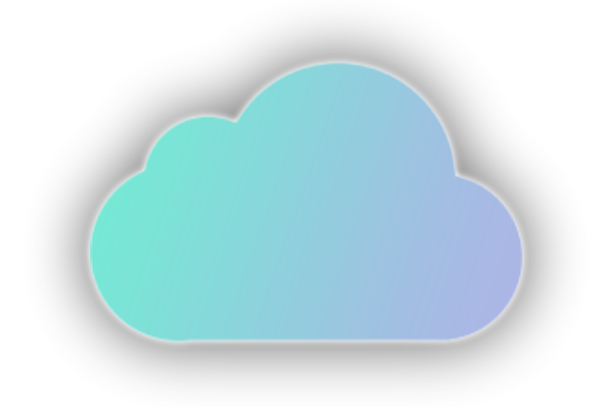

    
    

        <h1>screenie</h1>
        <h5>ShareX screenshot uploader built with NodeJS and <a href="https://v5.daisyui.com/" target="_blank">DaisyUI</a></h5>
    

## Features
- Easy configuration
- Automatic config generation for each user
- A user-friendly dashboard
- Archive management to zip the users uploaded files and let them download for 30 days
- User profile management with custom vanity URL and much more
- Badge system for users
- Storage capacity management
- Detailed user and admin dashboard
- Theme customization with [multiple themes available](https://v5.daisyui.com/docs/themes/)

## Screenshots

    
User Dashboard

    

    
Admin Dashboard

    

    
Archive Management

    

    
Profile Customization

    

    
Example Public Profile

    

    
User Management Dashboard

    

## Documentation
The documentation has moved to a completely new website avaliable [here](https://docs.screenie.host)! For guides, please refer to this site.
